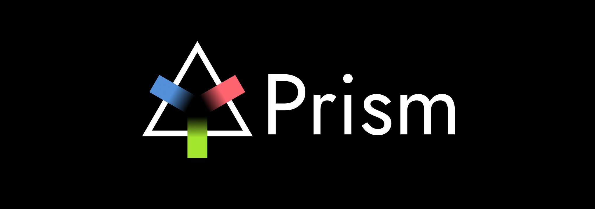

Prism is an experimental Horizon OS emulator for Windows PCs. It aims to run Meta's own Horizon
OS system software (the home environment, system UI, panels and apps) on a PC, in a desktop window
first and later in a PC VR headset.

> **Status:** Horizon runs in a desktop window. It boots to Meta's home environment, and from the PC
> you can look around, point at and click panels, open the Universal Menu and the library, and
> launch apps: Android apps open as panels, and OpenXR games run as immersive apps on Meta's own
> runtime and compositor. Next: panels' glass backgrounds, then output to a PC VR headset. See
> [Progress](#progress), [docs/plan.md](docs/plan.md) and
> [docs/m1-progress.md](docs/m1-progress.md).

## Progress

| Milestone | State |
|---|---|
| M0: Extract the OTA and take inventory | Done |
| M1: Boot Horizon's Java layer | Done |
| M2: Native daemons and hardware services | Done for what Home and apps need |
| M3: Home in a desktop window | Done |
| M4: More than one app at a time | In progress |
| M5: PC VR headset | Not started |
| M6: Launcher and packaging | Not started |

What works:

- **Boot.** Horizon boots to VrShell, Meta's home shell. Meta's native daemons and apps run as
  arm64 code translated to x86_64 by the Digitalis translator, and system_server runs every Meta
  service.
- **Meta's XR stack.** Meta's OpenXR runtime and compositor run translated, drawing on the PC's
  GPU. The compositor runs at 60 frames a second, the display's rate.
- **The desktop viewer** (`tools\viewer.py`). The mouse aims the right controller's ray, the left
  button pulls its trigger, Tab presses the Meta button, right-drag looks around, and WASD and R/F
  move.
- **Tracking.** The headset and two Touch Plus controllers are tracked, paired and held, all driven
  from the PC. VrShell draws the controllers and their rays.
- **Panels.** Panels draw and respond to clicks: the Universal Menu, the system bar and Quick
  Settings, and the library with Horizon's own apps.
- **Apps.** Android apps installed with adb open as panels. OpenXR apps (Vulkan or OpenGL ES) run
  as Horizon's immersive app at full frame rate. They launch from the library's Unknown Sources,
  and the Universal Menu opens over them and quits them.
- **Offline.** First-time setup is skipped and a placeholder local sign-in stands in for a Meta
  account.

Not yet:

- Panels' frosted-glass backgrounds.
- Passthrough (black: there are no cameras).
- The Store, Meta accounts and other online features. These are out of scope (see
  [Scope](#scope)).
- Output to a PC VR headset (M5), and building the image in one step (M6).

## How it works

Horizon OS is Android 14 plus a large Meta layer. Prism keeps the bottom of the stack from the
x86_64 Android Emulator (kernel, drivers, GPU forwarding to the PC's graphics card) and puts
Horizon's own software on top of it:

```text
Meta apps (VrShell, SystemUX, ...)       Horizon APKs, arm64 code translated to x86_64
Horizon Java framework + system_server   Horizon jars, recompiled by ART for x86_64
Meta native daemons                      Horizon arm64 binaries, translated
Hardware services (tracking, cameras,    Prism reimplementations, driven from the PC
  calibration, guardian, display)
Kernel, HALs, GPU                        Android Emulator x86_64 (Goldfish + Gfxstream)
```

## Bring your own OTA

This repository contains no Horizon OS files and never will. You supply a full OTA for your own
headset; Prism unpacks and analyses it locally. Everything derived from it goes to `work/`, which
is ignored by git.

Requirements: Python 3.10+, and the Android SDK with
`system-images;android-34;google_apis;x86_64` (the stock baseline Prism compares against and builds
on).

```powershell
python tools\prepare.py path\to\horizon-ota.zip
```

This extracts the partitions, files and APEX modules, unpacks the stock emulator image, and writes
an inventory to `work\inventory\report.md`.

The steps that then build Prism's parts, deploy Horizon onto the emulator and open the viewer are
in [docs/m1-progress.md](docs/m1-progress.md#running-it).

## Repository layout

```text
tools/prepare.py      One-command workspace setup from an OTA
tools/ota/            OTA payload, ext4, APEX and super-partition unpackers (pure Python)
tools/inventory/      Horizon vs stock Android analysis (dex, binary XML, ELF readers)
tools/emulator.py     Prism's AVD: create, start, root, status
tools/jni/            Builds Prism's JNI glue for the user's Horizon build
tools/compat.py       Compatibility patches in Horizon's framework jars (via smali)
tools/translator.py   Adapts the Digitalis ARM64 translator to Prism's Android 14 base
tools/vulkan.py       Builds Prism's Vulkan driver (wraps the emulator's)
tools/gles.py         Builds Prism's GLES layer (shared swapchains and multiview for GLES apps)
tools/tracking.py     Builds Prism's tracking service (Meta's MemoryBroker, head and controllers)
tools/hidl.py         Builds Prism's HIDL services (Meta's controller HAL, system suspend)
tools/thermal.py      Builds Prism's thermal and maintenance boot HALs
tools/spaces.py       Builds Prism's space service (Meta's space manager, for system_server)
tools/relay.py        Builds the binder bridge between arm64 apps and the host's Java binder
tools/guest_media.py  Builds the arm64 media functions Meta's libraries expect
tools/head.py         Moves the headset from the PC: mouse and keys drive the head pose
tools/viewer.py       Horizon in a desktop window: the mouse points and clicks, keys move
tools/xrprobe.py      Builds and runs Prism's OpenXR test apps (xrprobe, xrdemo, xrgame)
tools/smali.py        smali/baksmali, fetched on first use
tools/deploy.py       Puts Horizon's layer onto the emulator
native/prism_jni/     JNI glue between Horizon's Java and stock native code
native/berberis_compat/  Symbols the Android 16 translator build needs from Android 14
native/vulkan_prism/  Vulkan driver: gfxstream plus opaque-fd memory for Meta's compositor
native/gles_prism/    GLES layer: GL_EXT_memory_object_fd and multiview for the emulator's GLES
native/tracking_prism/   Tracking service: the head, the controllers and their tracking
native/hidl_prism/    Meta's controller HAL and the HIDL system suspend
native/thermal_prism/ Thermal HAL and maintenance boot HAL
native/spaces_prism/  Space service over Meta's space manager (its C API, reconstructed)
native/binder_relay/  Binder bridge between an app's arm64 libbinder and the host's Java binder
native/guest_media/   arm64 media functions Meta's libraries expect
native/viewer/        The desktop viewer (Direct3D 11)
native/xrprobe/       OpenXR test app: logs what Horizon's runtime gives an app
native/xrdemo/        OpenXR test app that draws (xrdemo, xrgame, xrgles)
prebuilts/digitalis/  The Digitalis translator (Apache 2.0; see its NOTICE)
docs/                 Plan, findings and progress
```

## Scope

Prism is for running software from a headset you own, for research and development. It does not
fake Quest device identity or attestation, and Meta account sign-in and the Store are out of
scope. Do not use it to bypass DRM, platform security or license terms.

## License

Prism is source-available, not open source. You may download, build, run and modify it for your
own personal use, and fork it on GitHub to send contributions. You may not sell it or
redistribute it, modified or not, in source or binary form. See [LICENSE](LICENSE) for the full
terms. Third-party components under `prebuilts/` keep their own licenses.
